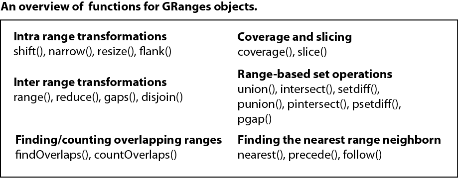

---
output:
  rmarkdown::html_document:
    highlight: pygments
    toc: false
    toc_depth: 3
    fig_width: 5
vignette: >
  %\VignetteIndexEntry{Finding overlaps between GenomicRanges}
  %\VignetteEngine{knitr::rmarkdown}
  %\VignetteEncoding[utf8]{inputenc}  
---

# Finding overlaps between *GRanges* objects



Interval overlapping is the process of comparing the ranges in two
objects to determine whether and to which extent they overlap. 
As such, it is perhaps the most common operation performed on *GRanges* objects.
To this end, the `r BiocStyle::Biocpkg("GenomicRanges")`
package provides a family of interval overlap functions. 
The most general of these functions is `findOverlaps()`, which takes a query 
and a subject as inputs and returns a `Hits` object containing
the index pairings for the overlapping elements.

Let us assume that we have three random `data.frame` objects, each with
annoyingly differing ways of naming the columns that define the ranges.

```{r reps}
set.seed(486)

pos <- sample(1:200, size = 30)
size <- 10
end <- size + pos - 1
chrom <- sample(paste0("chr", 1:3), size = 30, replace = TRUE)

query_df <- data.frame(chrom = chrom, start = pos, end = end)
query_dfs <- split(query_df, 1:3)

q1 <- rename(query_dfs[[1]], start = "pos")
q2 <- rename(query_dfs[[2]], chrom = "ch", start = "st")
q3 <- rename(query_dfs[[3]], end = "last")
```

The `makeGRangesFromDataFrame()` function can guess some of these, but
not all of them.

```{r makeGRangesFromDataFrame}
q1 <- makeGRangesFromDataFrame(q1, start.field = "pos")
q2 <- makeGRangesFromDataFrame(q2, seqnames.field = "ch", start.field = "st")
q3 <- makeGRangesFromDataFrame(q3, end.field = "last")

query <- mstack(q1, q2, q3, .index.var="replicate")
sort(query, by = ~ start)
```

Above, we use the convenient `mstack()` function, which stacks its
arguments, populating the `.index.var=` column with the origin of each
range (using the argument names or positions).

Perhaps the simplest overlap-based operation is `subsetByOverlaps()`,
which extracts the elements in the query (the first argument) that
overlap at least one element in the subject (the second).

```{r subsetByOverlaps}
subject <- gr
subsetByOverlaps(query, subject, ignore.strand=TRUE)
```
In every call to an overlap operation, it is necessary to specify
`ignore.strand=TRUE`, except in rare cases when we do not want ranges
on opposite strands to be considered overlapping.

To generally compute on the overlaps, we call `findOverlaps()` to
return a `Hits` object, which is essentially a bipartite graph
matching query ranges to overlapping subject ranges.

```{r findOverlaps}
hits <- findOverlaps(query, subject, ignore.strand=TRUE)
hits
```

We typically use the hits to perform one of two operations: join and
aggregate. For example, we could inner join the scores from the
subject using the query and subject indexes.

```{r innerJoin}
joined <- query[queryHits(hits)]
joined$score <- subject$score[subjectHits(hits)]
joined
```

The above carries over a single metadata column from the
subject. Similar code would carry over other columns and even the
ranges themselves. 

Sometimes, we want to merge the matched query and subject ranges,
typically by finding their intersection.

```{r overlapIntersect}
ranges(joined) <- ranges(pintersect(joined, subject[subjectHits(hits)]))
joined
```

The typical aggregation is counting the number of hits overlapping a
query. In general, aggregation starts by grouping the subject hits by
query hits, which we express as a coercion to a `List`.

```{r hitsAsList}
hitsByQuery <- as(hits, "List")
hitsByQuery
```

The result is an `IntegerList`, a type of `AtomicList`. 
`AtomicList` objects have many methods for efficient aggregation. 
In this case, we just call `lengths()` to get the count:

```{r lengthsHits}
counts <- lengths(hitsByQuery)
counts
```

Since this a common operation, there are shortcuts:

```{r countHits}
counts <- countQueryHits(hits)
counts
```

Or even shorter and more efficient:

```{r countOverlaps}
counts <- countOverlaps(query, subject, ignore.strand=TRUE)
unname(counts)
```

Often, we want to combine joins and aggregations. For example, we may
want to annotate each query with the maximum score among the subject
hits.

```{r joinMax}
query$maxScore <- max(extractList(subject$score, hitsByQuery))
subset(query, maxScore > 0)
```

In rare cases, we can more or less arbitrarily select one of the
subject hits. The `select=` argument to `findOverlaps()` automatically
selects an "arbitrary", "first" (in subject order) or "last" subject
range.

```{r select-first}
hits <- findOverlaps(query, subject, select="arbitrary", ignore.strand=TRUE)
hits
```

## Exercises (15 min)

We consider the overlap of gene promoter regions and CpG islands in the human genome.
We use the collection of CpG islands described in
[Wu et al., 2010](https://doi.org/10.1093/biostatistics/kxq005).

1. Import the collection of CpG islands from
[here](http://www.haowulab.org/software/makeCGI/model-based-cpg-islands-hg19.txt)
as a `GRanges`. 
2. Import the promoter regions in the *hg19* human genome assembly as available 
[here](http://gattaca.imppc.org/regioner/data/UCSC.promoters.hg19.bed)
as a `GRanges`. 
3. Determine the percentage of promoters on chromosome 21 that overlap with at 
least one CpG island. 
4. For those promoters that overlap with CpG islands, annotate the number of 
overlapping CpG islands as an additional column.
What is the maximum number of overlapping CpG islands for one promoter at a time? 
