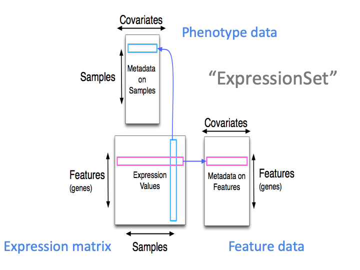

---
output:
  rmarkdown::html_document:
    highlight: pygments
    toc: false
    toc_depth: 3
    fig_width: 5
vignette: >
  %\VignetteIndexEntry{ExpressionSet}
  %\VignetteEngine{knitr::rmarkdown}
  %\VignetteEncoding[utf8]{inputenc}  
---

[Biobase]: https://bioconductor.org/packages/Biobase

# Working with ExpressionSet  

This section introduces a predecessor of the `SummarizedExperiment` container - the 
`ExpressionSet` container implemented in the [Biobase][] package.
Although it has been largely replaced by `SummarizedExperiment`, there are still
many instances / Bioconductor packages that contain and operate on `ExpressionSet`. 
Due to its widespread legacy, it is therefore important to be familiar with 
`ExpressionSet`, and to understand similarities and differences with respect to 
`SummarizedExperiment`.

## Bioconductor containers for genomic high-throughput data


**Pros**

* Interoperability: established classes for specifically representing such data

* Integrated subsetting / coordination

* Specific functions & Automatic behaviors

**Cons**

* Initial effort to load data + create object

* Requires additional learning process to get familiar with the data structure 


## Coordinating information from diverse tables: gains from integration

Maintaining data that belongs together in spreadsheets / individual tables is 
risky and prone to bookkeeping errors.
Transforming spreadsheets to semantically rich objects that allow coordinated 
manipulation has several benefits.
We demonstrate these aspects using expression data from the experimental data 
package [GSE5859Subset](https://github.com/genomicsclass/GSE5859Subset), 
derived from a [study](https://www.ncbi.nlm.nih.gov/pubmed/17206142) of genetics 
of gene expression. 

We install the package directly from [GitHub](https://github.com/), which requires
to install the [remotes](https://cran.r-project.org/package=remotes) package first.

```{r, eval=FALSE}
BiocManager::install("remotes")
BiocManager::install("genomicsclass/GSE5859Subset")
```

Upon attachment and loading of package data, we have three data tables:

```{r, message=FALSE}
library(GSE5859Subset)
data(GSE5859Subset)
dim(geneExpression)
dim(geneAnnotation)
dim(sampleInfo)
```

How are these tables related?

```{r}
all.equal(sampleInfo$filename, colnames(geneExpression))
all.equal(rownames(geneExpression), geneAnnotation$PROBEID)
```

We can think of `sampleInfo$filename` as a key for joining, row by row, 
the sample information table with the _transposed_ gene expression matrix. 
The `colnames` of the gene expression matrix link the columns of that matrix to 
samples listed in the rows of `sampleInfo`.

Likewise, the `rownames` of `geneExpression` coincide exactly with the `PROBEID` 
field of `geneAnnotation`.

```{r}
options(digits=2)
cbind(sampleInfo[1:3,], colnames(geneExpression)[1:3], 
    t(geneExpression)[1:3,1:4])
```

## Binding the tables together in an ExpressionSet

 

The `ExpressionSet` container manages all three tables in one object. 
We just have to make sure that the annotation for the individual components is 
consistent.

```{r}
rownames(sampleInfo) = sampleInfo$filename
rownames(geneAnnotation) = geneAnnotation$PROBEID
```

Now we construct the `ExpressionSet`.

```{r, message=FALSE}
library(Biobase)
eset <- ExpressionSet(assayData = geneExpression)
pData(eset) <- sampleInfo
fData(eset) <- geneAnnotation
eset
```

One of the nice things about this arrangement is that we can easily select 
features using additional information annotated in the `fData` and `pData` components. 
For example to obtain expression data for genes on the Y chromosome only:

```{r}
eset[fData(eset)$CHR == "chrY",]
```

The full set of methods to which `ExpressionSet` instances respond can be seen using

```{r}
methods(class="ExpressionSet")
```

The most important methods are

- `exprs()`: get/set the numerical expression values 
- `pData()`: get/set the sample-level data 
- `fData()`: get/set feature-level data 
- `annotation()`: get/set a tag that identifies nomenclature for feature names 
- `experimentData()`: get/set a [MIAME](https://www.ncbi.nlm.nih.gov/geo/info/MIAME.html)-compliant metadata structure 

We can enrich this object with more information about the study / experiment. 
First, we set the annotation field with the corresponding microarray chip ID.

```{r}
annotation(eset) <- "hgfocus" 
```

Second, we acquire MIAME-compliant metadata about the experiment.

```{r, message=FALSE}
library(annotate)
mi <- pmid2MIAME("17206142")
mi
experimentData(eset) <- mi
eset
```


## Exercises (15 min)

1. Install the [ALL](https://bioconductor.org/packages/ALL) experimental data package.
Load the dataset and extract the following information about the experiment: how many features and how many samples are measured? Which additional characteristics are annotated for the samples? Which microarray platform has been used (microarry chip ID)? Where has the experiment been conducted and which PUBMED IDs can be consulted for more information?

2. Install the [EnrichmentBrowser](https://bioconductor.org/packages/EnrichmentBrowser) package. The package implements a function `probe2gene` that allows to easily summarize microarray probe level expression to gene level expression (as described in the vignette, Section 3.1). Use the function to summarize the expression levels for the ALL dataset. How many genes are contained in the summarized dataset? 

3. Install the [curatedMetagenomicData](https://bioconductor.org/packages/curatedMetagenomicData) package. The package contains whole-metagenome sequencing datasets for thousands of human microbiome samples, and demonstrates the usage of `ExpressionSet` for microbiome data. Section 3 of the vignette describes how to access individual datasets. Follow the description to obtain the `ZellerG_2014` dataset. What is the mean age of the patients studied in the dataset? Which diseases are monitored in this experiment?
