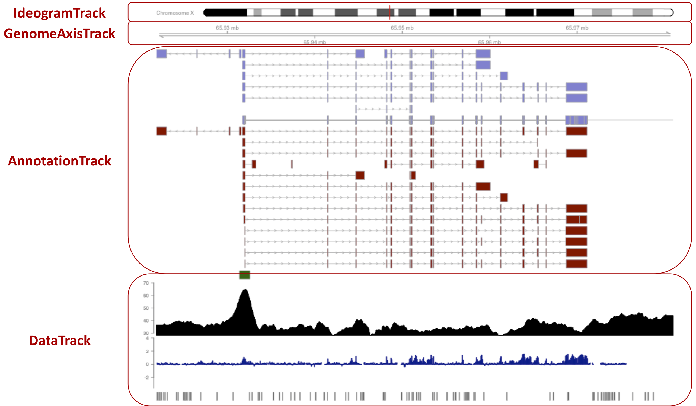

---
output:
  rmarkdown::html_document:
    highlight: pygments
    toc: false
    toc_depth: 3
    fig_width: 5
vignette: >
  %\VignetteIndexEntry{Gviz}
  %\VignetteEngine{knitr::rmarkdown}
  %\VignetteEncoding[utf8]{inputenc}  
---

# Visualizing genomic region data

Genomic data analysis requires integrated visualization of genomic information 
and experimental data. 
Popular genome browsers such as [ENSEMBL](https://www.ensembl.org/) and 
[UCSC](https://genome.ucsc.edu/) are typically used to display genome annotation
data.
However, customization of such visualization and overlay with additional 
experimental data does not meet the flexibility of the R graphics system. 
The [Gviz](https://bioconductor.org/packages/Gviz) package 
offers a flexible framework to visualize genomic data together with genome 
annotation features.
It integrates with the [GenomicRanges](https://bioconductor.org/packages/GenomicRanges) 
infrastructure, and provides data retrieval from external sources like 
[ENSEMBL](https://www.ensembl.org/) and [UCSC](https://genome.ucsc.edu/).
This greatly facilitates customized visualization of experimental data and genomic 
anntation for specific genomic loci. 


## Visualizing genomic region data from individual tracks

As for most genome browsers, the fundamental concept behind 
[Gviz](https://bioconductor.org/packages/Gviz) 
is that individual types 
of genomic features or data are represented by separate tracks. 
Each track is a single object, and there are constructors and methods 
to interact with and to plot these tracks.





`Gviz` creates track objects from `GRanges` objects storing genomic region data.
We consider an example set of CpG islands on chromosome 7 of the human hg19 genome
assembly.

```{r cpgData, message=FALSE}
library(Gviz)
library(GenomicRanges)
data(cpgIslands)
cpgIslands
```

### AnnotationTrack

Genomic annotation features such as exons, transcripts, and genes are represented
by `AnnotationTrack` objects. We use the constructor function to create an 
annotation track representing the genomic coordinates of the example set of CpG 
islands.

```{r}
atrack <- AnnotationTrack(cpgIslands, name="CpG")
```

Individual tracks are displayed with the `plotTracks` function.

```{r, fig.width=7.5, fig.height=0.5}
plotTracks(atrack)
```

Apart from the relative distance of the CpG islands, this visualization 
is not very informative. 
For reference, we need the genomic coordinates that we are currently looking at.

### GenomeAxisTrack

For this purpose, we construct a `GenomeAxisTrack`.

```{r}
gtrack <- GenomeAxisTrack()
```

A `GenomeAxisTrack` object is always relative to the other tracks that are plotted,
and we can pass this additional track on to `plotTracks` in the form of a list.

```{r, fig.width=7.5, fig.height=1.1}
plotTracks(list(gtrack, atrack))
```

### IdeogramTrack

Each track is defined for a chromosome on a specified genome. 
This information can be displayed by a chromosome ideogram. 
An ideogram is a simplified visual representation of a chromosome, indicating the
location of the centromere and chromosomal staining bands.
Chromosome information is available from online repositories such as UCSC. 
The `IdeogramTrack` constructor allows to conviently retrieve this
information, given the genome and chromosome under consideration.

```{r}
itrack <- IdeogramTrack(genome="hg19", chromosome="chr7")
```

As before, we combine the additional ideogram track object with the other two 
tracks in a list and plot it with `plotTracks`.

```{r, fig.width=7.5, fig.height=1.5}
plotTracks(list(itrack, gtrack, atrack))
```

The genomic region under consideration is indicated on the chromosome by a red 
box (or, as in this case, a red line if the width is too small to fit a box).

### GeneRegionTrack

So far, we looked at basic annotation features and how to illustrate the chromosomal 
location.
The `GeneRegionTrack` is a specialized `AnnotationTrack` representing more complex
annotation features such as gene models. 
For demonstration, we use example gene model data contained in the `Gviz` package,

```{r}
data(geneModels)
geneModels <- makeGRangesFromDataFrame(geneModels, keep.extra.columns=TRUE)
geneModels
```

and add a `GeneRegionTrack` to the genomic plot.

```{r, fig.width=7.5, fig.height=3} 
grtrack <- GeneRegionTrack(geneModels, name="Gene Model")
plotTracks(list(itrack, gtrack, atrack, grtrack))
```

To identify each transcript, we can annotate e.g. the corresponding gene symbol.

```{r, fig.width=7.5, fig.height=3}
grtrack <- GeneRegionTrack(geneModels, name="Gene Model", transcriptAnnotation="symbol")
plotTracks(list(itrack, gtrack, atrack, grtrack))
```

### DataTrack

Displaying genome annotation in a genomic region of interest can also
be done in online genome browsers. 
The real power of the `Gviz` package lies in plotting additional data from experiments
or computations with the general `DataTrack`. 
A `DataTrack` is essentially a run-length encoded numeric vector or matrix, 
and we can use such a track to add all sorts of numeric data to a genomic region plot. 
Various visualization options are available for these tracks, including dot plots, 
histograms, and boxplots. 

For demonstration, we create a simple `DataTrack` from randomly sampled scores 
for each CpG island.

```{r} 
cpgIslands$score <- runif(length(cpgIslands), min = 1, max = 100)
cpgIslands
```

```{r, fig.width=7.5, fig.height=5}
dtrack <- DataTrack(cpgIslands, name="Score")
plotTracks(list(itrack, gtrack, atrack, grtrack, dtrack))
```

The scores are matched to the genomic coordinates of the DataTrack.


```{r, fig.width=7.5, fig.height=5}
dtrack <- DataTrack(cpgIslands, name="Score", type="histogram")
plotTracks(list(itrack, gtrack, atrack, grtrack, dtrack))
```

## Exercises (10 min)

1. Use the `littleTicks` display parameter to construct a more fine-grained 
`GenomeAxisTrack`.

2. Annotate transcripts in the `GeneRegionTrack` with ENSEMBL transcript ID 
instead of gene symbol. 

3. Add an additional data track that displays the width of each CpG island. 

