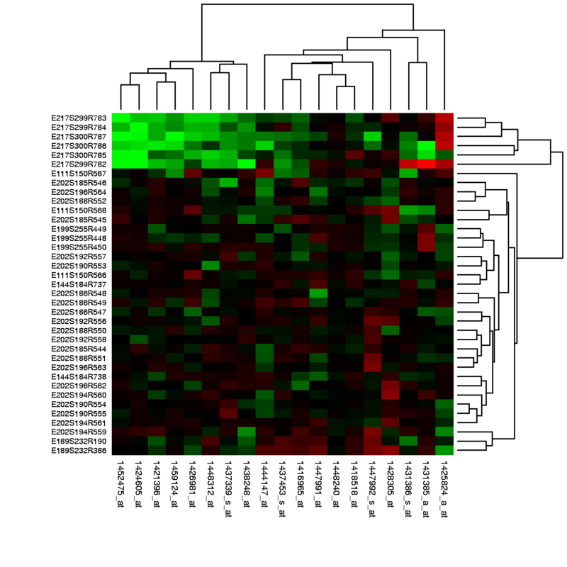

---
output:
  rmarkdown::html_document:
    highlight: pygments
    toc: false
    toc_depth: 3
    fig_width: 5
vignette: >
  %\VignetteIndexEntry{Gviz}
  %\VignetteEngine{knitr::rmarkdown}
  %\VignetteEncoding[utf8]{inputenc}  
---

# Visualizing genomic high-throughput data in a Heatmap

A heatmap is a graphical representation of data where the individual values 
contained in a matrix are represented as colors. 
Heatmaps are frequently used for visualising gene expression data (genes x samples),
but are equally suited for displaying other types of genomic high-throughput data
in a matrix-like format. 



In heatmaps the data is displayed in a grid where each row represents a gene and
each column represents a sample. The color and intensity of the boxes is used to
represent gene expression levels. In the example, red represents up-regulated 
genes and green represents down-regulated genes. Black represents unchanged expression.

The heatmap may also be combined with clustering methods which group genes and/or 
samples together based on the similarity of their gene expression pattern. 
This can be useful for identifying genes that are commonly regulated, or 
biological signatures associated with a particular condition (e.g. a disease or 
an environmental condition).

Heatmaps are a powerful way of visualizing large, matrix-like datasets and
providing a quick overview of the patterns that might be in the data. There are 
a number of heatmap drawing functions / packages in R; a very versatile and 
modular strategy to drawing heatmaps is implemented in the
[ComplexHeatmap](http://bioconductor.org/packages/ComplexHeatmap) package. 


## Visualizing genomic high-throughput data with ComplexHeatmap

The [ComplexHeatmap](http://bioconductor.org/packages/ComplexHeatmap) package 
comes with an easy-to-use interface for drawing heatmaps and produces
visually attractive output with default settings.
It also supports a high level of customization, which allows to construct complex
heatmaps with extended row and column annotations.
We start by loading the package.

```{r, message=FALSE}
library(ComplexHeatmap)
```

First let’s generate a random matrix where there are three groups by columns 
and three groups by rows:

```{r}
set.seed(123)

nr1 = 4; nr2 = 8; nr3 = 6; nr = nr1 + nr2 + nr3
nc1 = 6; nc2 = 8; nc3 = 10; nc = nc1 + nc2 + nc3

mat = cbind(rbind(matrix(rnorm(nr1*nc1, mean = 1,   sd = 0.5), nr = nr1),
          matrix(rnorm(nr2*nc1, mean = 0,   sd = 0.5), nr = nr2),
          matrix(rnorm(nr3*nc1, mean = 0,   sd = 0.5), nr = nr3)),
    rbind(matrix(rnorm(nr1*nc2, mean = 0,   sd = 0.5), nr = nr1),
          matrix(rnorm(nr2*nc2, mean = 1,   sd = 0.5), nr = nr2),
          matrix(rnorm(nr3*nc2, mean = 0,   sd = 0.5), nr = nr3)),
    rbind(matrix(rnorm(nr1*nc3, mean = 0.5, sd = 0.5), nr = nr1),
          matrix(rnorm(nr2*nc3, mean = 0.5, sd = 0.5), nr = nr2),
          matrix(rnorm(nr3*nc3, mean = 1,   sd = 0.5), nr = nr3))
   )

mat = mat[sample(nr, nr), sample(nc, nc)] # random shuffle rows and columns
rownames(mat) = paste0("row", seq_len(nr))
colnames(mat) = paste0("column", seq_len(nc))
```

The main function of the package is the `Heatmap()` function, which visualizes 
a matrix as a heatmap with convenient default settings. 
It draws the dendrograms, the row/column names and the heatmap legend. 
The default color schema is “blue-white-red” which is mapped to the minimal-mean-maximal 
values in the matrix. 

```{r}
Heatmap(mat)
```

We can easily add labels for rows, columns, and the name of the heatmap.

```{r}
Heatmap(mat, name = "mat", column_title = "I am a column title", 
    row_title = "I am a row title")
```

We can also turn off clustering of rows and/or columns to preserve a pre-defined
order.

```{r}
Heatmap(mat, name = "mat", cluster_rows = FALSE)
```

### Annotation

Heatmap annotations are useful for showing additional information associated with the
rows or columns of the heatmap.
With `ComplexHeatmap`, annotations can flexibly be defined and displayed using 
also user-defined annotation graphics. 
Annotation can be added to each side of the heatmap, using `top_annotation`,
`bottom_annotation`, `left_annotation`, and `right_annotation`.

Annotations are represented by the `HeatmapAnnotation` class, with instances 
constructed using the `HeatmapAnnotation()` function.

Let's consider a simple example.

```{r}
set.seed(123)
mat = matrix(rnorm(100), 10)
rownames(mat) = paste0("R", 1:10)
colnames(mat) = paste0("C", 1:10)

column_ha = HeatmapAnnotation(foo1 = runif(10), bar1 = anno_barplot(runif(10)))
row_ha = HeatmapAnnotation(foo2 = runif(10), bar2 = anno_barplot(runif(10)), which="row")

Heatmap(mat, name = "mat", top_annotation = column_ha, right_annotation = row_ha)
```

### Real-world application

To demonstrate the usage of heatmaps for real data, we return to the mouse single
cell data of the
[Hiiragi2013](http://bioconductor.org/packages/Hiiragi2013) package.

```{r}
library(Biobase)
library(Hiiragi2013)

data(x)
eset <- x
```

We first select the top 100 most variable genes in the dataset and the 
center each gene (row) by subtracting the mean across columns.

```{r}
top.genes <- order(rowVars(exprs(x)), decreasing = TRUE)[1:100]
top.eset <- eset[top.genes,]

exprs(top.eset) <- exprs(top.eset) - rowMeans(exprs(top.eset))
```

We add information about the sample groups as an annotation bar to the top of 
the heatmap. 

```{r}
col.anno <- HeatmapAnnotation(Group=pData(eset)$sampleGroup)

Heatmap(exprs(top.eset), 
        show_row_names = FALSE, 
        show_column_names = FALSE, 
        name = "",
        top_annotation = col.anno)
```

This demonstrates similar expression within sample groups, indicating the existence
of a gene signature that allows to discriminate between early development stages.

## Exercises (10 min)

1. Display the 100 most variable genes of the [ALL](http://bioconductor.org/packages/ALL) 
dataset. Annotate the patient group to the heatmap based on the `mol.biol` variable 
contained in the `pData` table of the `ALL` dataset.  


